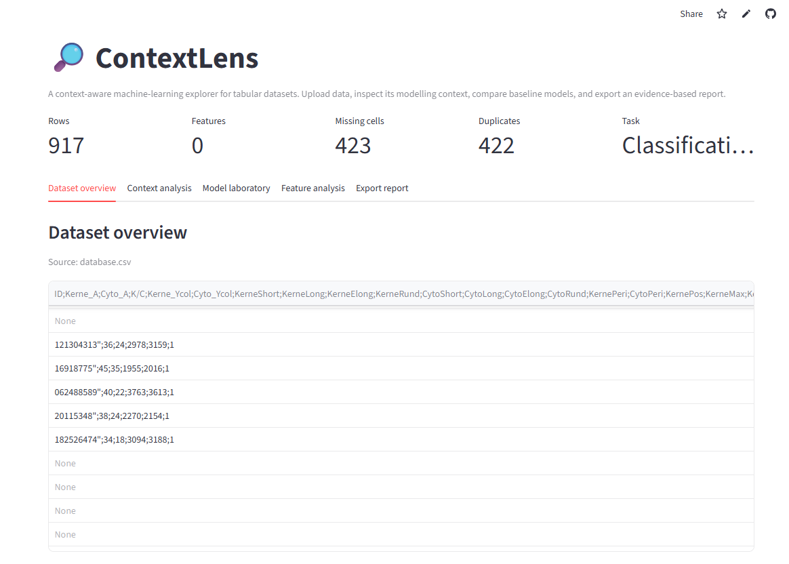
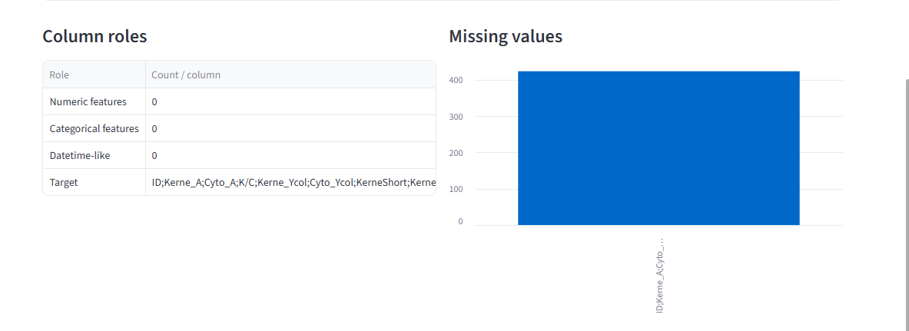
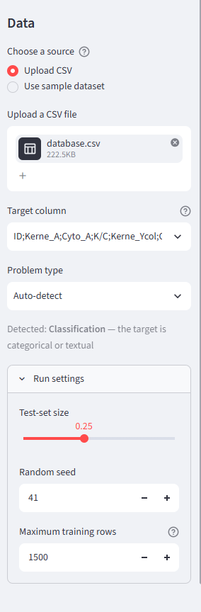

# ContextLens 🔎

## Live Application

[Launch ContextLens](https://contextlens-ana.streamlit.app/)

## Built With

- Python
- Streamlit
- Pandas
- NumPy
- Scikit-learn


## Application Preview




**ContextLens** is a context-aware machine-learning explorer for tabular CSV data.  
It profiles a dataset, explains its modelling context, flags common data risks,
trains reproducible baseline pipelines, compares appropriate metrics, and exports
a Markdown analysis report.

> Built as a portfolio project connecting context-aware computing, data analysis,
> explainable modelling, and practical Python application development.

## What it does

- Upload any tabular CSV or open the included sample dataset.
- Select a target and auto-detect classification versus regression.
- Identify missingness, duplicates, constant columns, possible identifiers,
  high-cardinality categories, class imbalance, small samples, and
  high-dimensional settings.
- Compare leakage-safe scikit-learn pipelines.
- Use macro-F1 for classification and RMSE for regression.
- Inspect confusion matrices, per-class reports, and global feature importance.
- Export a portable Markdown report.

## Why “context-aware”?

ContextLens does not claim that a heuristic is artificial intelligence. Its
context engine uses explicit rules that can be inspected in
`contextlens/analysis.py`. It adapts evaluation guidance and modelling warnings
to properties of the selected dataset and target.

## Architecture

```text
CSV
 │
 ├── Dataset profiler ──> transparent context rules ──> recommendations
 │
 └── Feature/target split
      └── train-test split
           └── preprocessing inside Pipeline
                ├── numeric: median imputation + scaling
                └── categorical: mode imputation + one-hot encoding
                     └── baseline model comparison
                          └── diagnostics + Markdown report
```

Preprocessing is fitted only on the training partition through scikit-learn
`Pipeline` and `ColumnTransformer`, reducing leakage from imputation, scaling,
and categorical encoding.

## Run locally

```bash
git clone https://github.com/YOUR_USERNAME/contextlens.git
cd contextlens

python -m venv .venv
```

Activate the environment:

```bash
# Windows PowerShell
.venv\Scripts\Activate.ps1

# macOS/Linux
source .venv/bin/activate
```

Install and run:

```bash
pip install -r requirements.txt
streamlit run app.py
```

Then open the local URL shown by Streamlit.

## Tests

```bash
python -m pytest
```

## Deploy on Streamlit Community Cloud

1. Push the repository to GitHub.
2. In Streamlit Community Cloud, create a new app.
3. Select the repository and branch.
4. Set the entry point to `app.py`.
5. Deploy.

## Suggested GitHub topics

`streamlit` · `machine-learning` · `context-aware-computing` · `data-science`
· `scikit-learn` · `explainable-ai` · `python`

## Current scope

This is an exploratory baseline application, not a full AutoML platform.
Current limitations include:

- one hold-out train/test split rather than repeated cross-validation;
- no time-series-aware splitting;
- global importance rather than local SHAP explanations;
- limited baseline model families;
- no causal, fairness, or domain-validity guarantees.

## Roadmap

- [ ] Repeated and nested cross-validation
- [ ] User-defined group and time-aware splits
- [ ] Genetic-algorithm feature selection
- [ ] SHAP explanations
- [ ] Saved experiment histories
- [ ] Domain-context templates for healthcare and IoT datasets
- [ ] Downloadable PDF report

## Responsible use

Model scores are not proof of real-world validity. High-stakes applications
require domain review, representative data, robust validation, fairness and
privacy assessment, and appropriate governance.

## License

MIT
